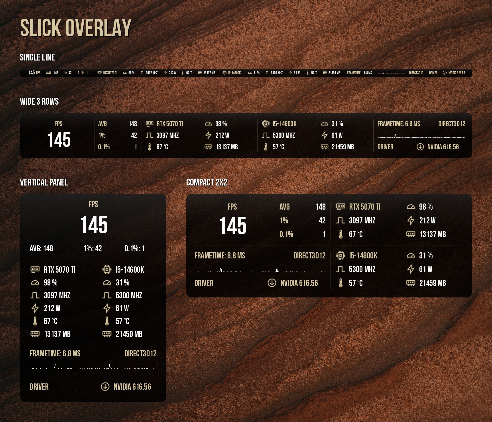
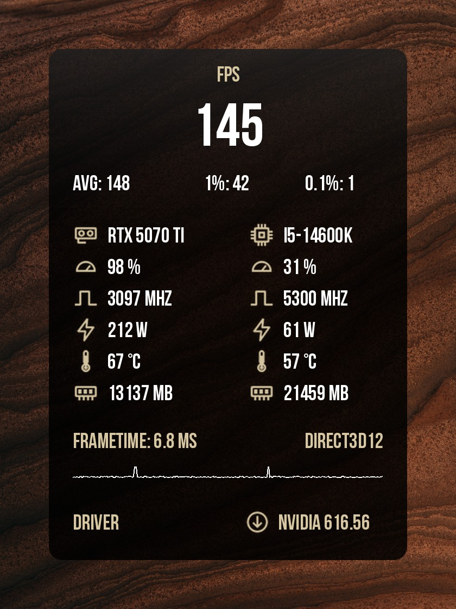
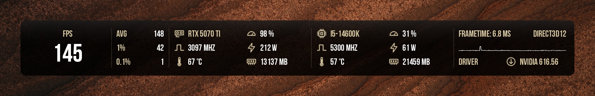
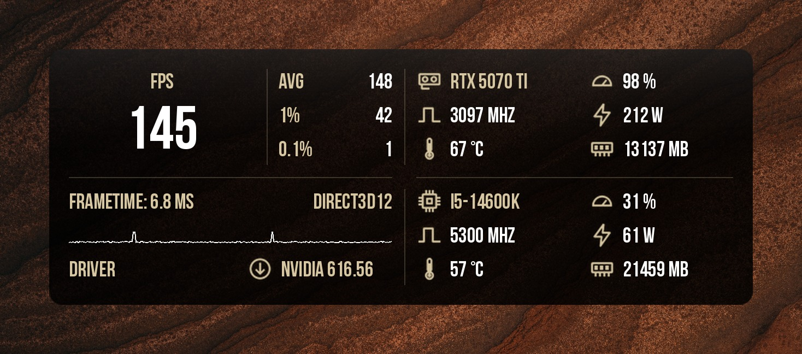
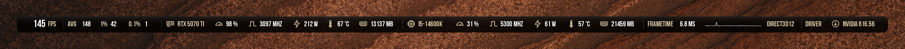

# Slick Overlay

Аккуратный оверлей мониторинга для **RivaTuner Statistics Server (RTSS)** с фоном в стиле матового стекла. Четыре раскладки: от одной строки до полной вертикальной панели.

[English version](README.md)

## Раскладки

| Раскладка | Размер (px) | Для чего |
|---|---|---|
| **Vertical Panel** | 330 × 470 | Полная статистика в углу экрана |
| **Wide 3 Rows** | 1214 × 122 | Верхний или нижний край экрана |
| **Compact 2x2** | 644 × 234 | Всё то же на меньшей площади |
| **Single Line** | 2279 × 44 | Минимальная полоса во всю ширину |

Превью

**Vertical Panel**

**Wide 3 Rows**

**Compact 2x2**

**Single Line**

## Что показывает

- **FPS:** текущий, средний, 1% low, 0.1% low
- **GPU:** название, загрузка, частота ядра, потребляемая мощность, температура, занятая видеопамять
- **CPU:** название, загрузка, частота, мощность, температура, занятая ОЗУ
- **График frametime** (0–40 мс) с текущим значением и используемый графический API
- **Версия драйвера**, подставляется автоматически

Все данные берутся из встроенного мониторинга RTSS (HAL). MSI Afterburner и HWiNFO не нужны.

## Требования

- RivaTuner Statistics Server 7.3.x с плагином **OverlayEditor** (идёт в комплекте с RTSS)
- Шрифт **Adderley Bold**, лежит в [`fonts/Adderley`](fonts/Adderley) (бесплатный, SIL Open Font License 1.1)

## Установка

1. Скачайте `SlickOverlay-vX.Y.Z.zip` из [Releases](../../releases) и распакуйте.
2. Установите шрифт: правый клик по `Adderley_Bold.ttf` → **Установить для всех пользователей**. Если RTSS был запущен, перезапустите его.
3. Скопируйте все файлы `.ovl` и `.png` в папку
   `C:\Program Files (x86)\RivaTuner Statistics Server\Plugins\Client\Overlays`
   Рядом с каждым `.ovl` должен лежать `.png` с тем же именем.
4. В RTSS откройте **Setup → Plugins**, включите **OverlayEditor.dll** и откройте его двойным кликом.
5. Выберите **Layouts → Load** и нужную раскладку.
6. В главном окне RTSS поставьте **On-Screen Display rendering mode** в **Raster 3D**, а **масштаб OSD** держите около **1**.

## Заметки

- **AVG / 1% / 0.1%** заполняются после запуска записи бенчмарка RTSS (горячая клавиша в Setup → Benchmark).
- **Перемещение оверлея:** двигайте его в главном окне RTSS. Отдельные слои в OverlayEditor не перетаскивайте, иначе элементы разъедутся.
- **Мыльный или пиксельный шрифт:** нужен Raster 3D и масштаб OSD 1. Увеличение OSD растягивает растровый шрифт.
- **Битый фон после замены `.png`:** RTSS кэширует встроенные картинки по имени файла, поэтому полностью перезапустите RTSS (выход из трея).
- **Длинное название GPU/CPU:** в слое `GPU - Value - Name` или `CPU - Value - Name` впишите короткое название вместо макроса.

## Настройка

Откройте раскладку в OverlayEditor и дважды кликните по слою.

| Что | Где |
|---|---|
| Диапазон графика frametime | Слой `FT - Graph`, тег `<G=Frametime,W,22,1,0,40,0>`: `0,40` — минимум и максимум в мс. Автомасштаб есть в настройках самого графика (кнопка **…**). |
| Надпись над счётчиком FPS | Слой `Header - FPS` |
| Цвета | `TextColor` в формате ARGB hex. Бежевый акцент `FFD6C6A1`, белый `FFFFFFFF`. |
| Прозрачность панели | Альфа цвета слоя `BG - Frost Base` или сам `.png` |

## Авторство

Иконки, графика панелей и раскладки созданы для этого проекта.

Шрифт: **Adderley**, автор gorohovskiy / [Dharma Type](http://dharmatype.com), лицензия [SIL Open Font License 1.1](fonts/Adderley/OFL.txt). Включён без изменений.

## Лицензия

Оверлеи, графика и документация: [MIT](LICENSE). У шрифта в `fonts/` своя лицензия: [SIL OFL 1.1](fonts/Adderley/OFL.txt).
